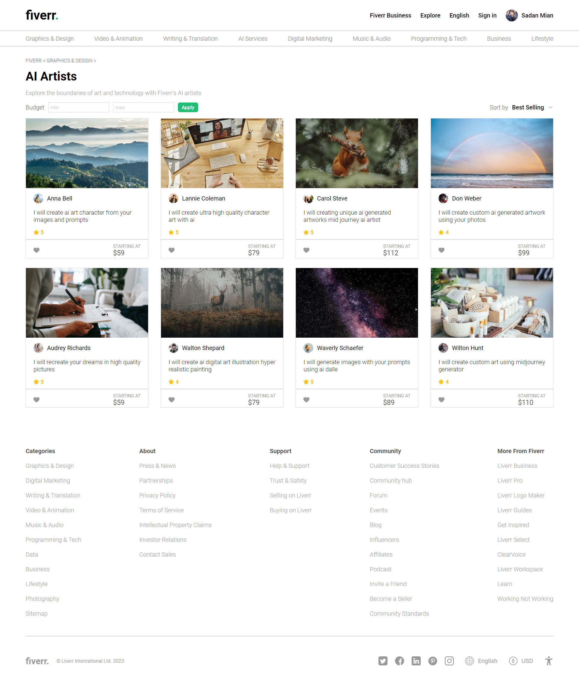
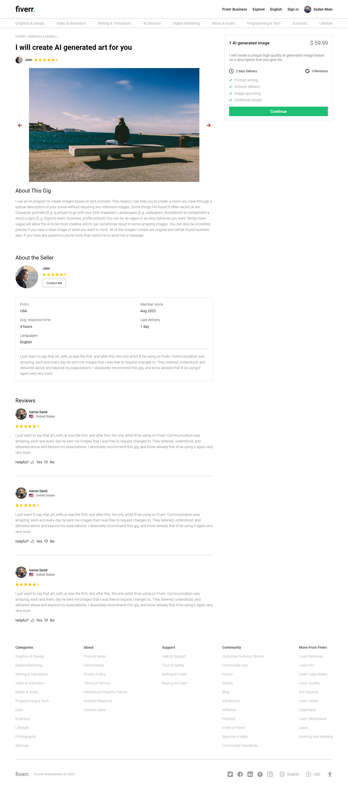
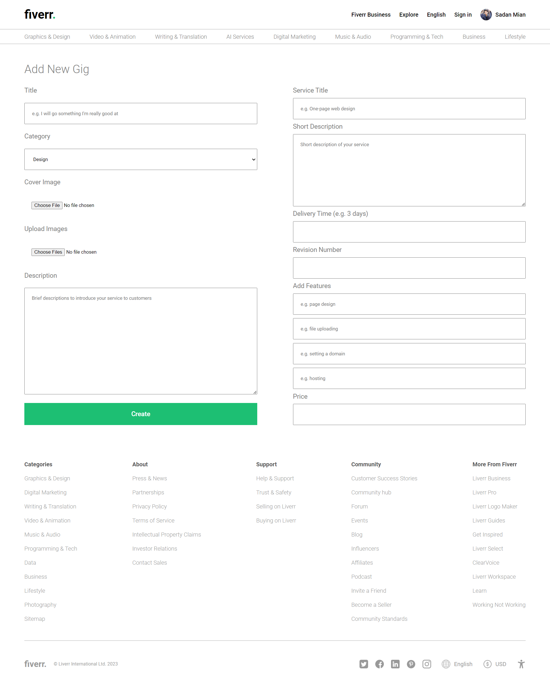
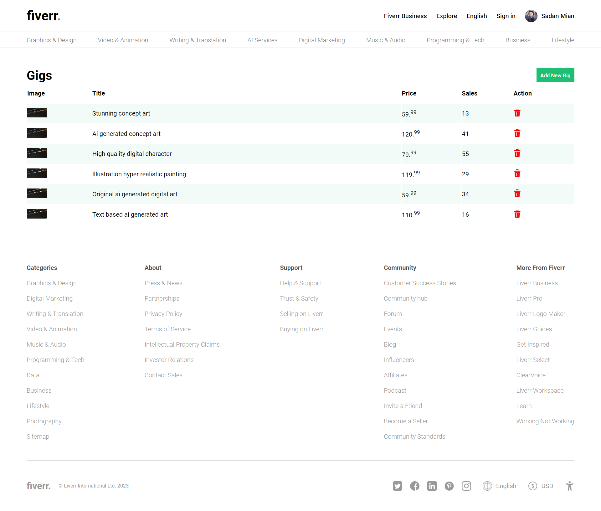
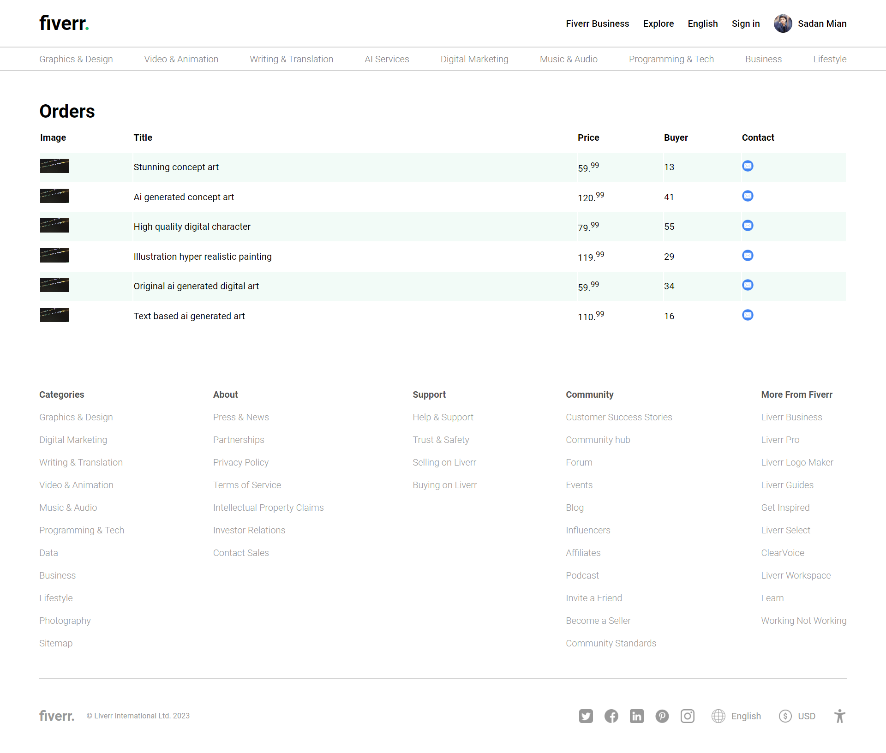
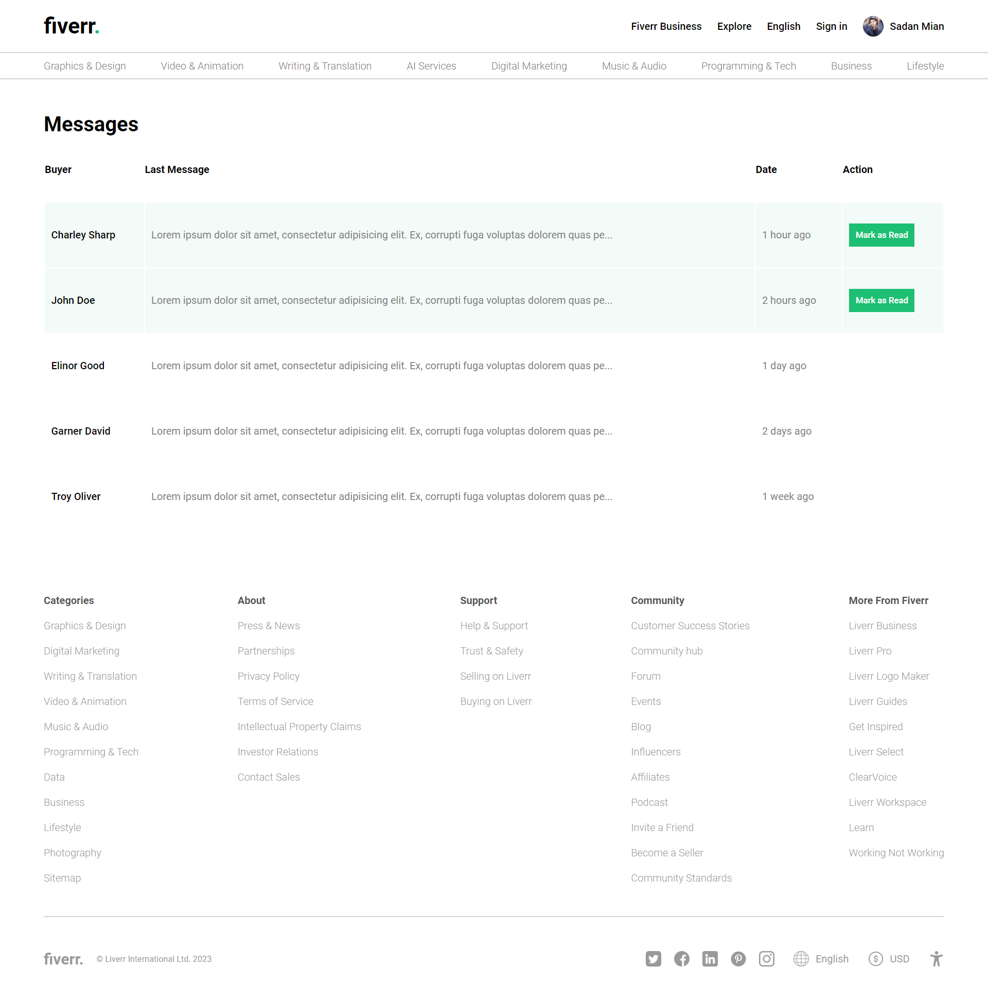
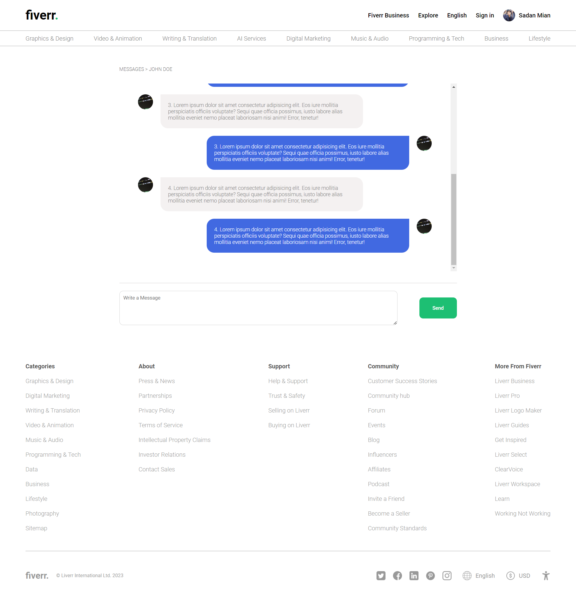

# Fiverr UI Clone - React Fiverr Clone


Welcome to the Fiverr UI Clone project! This is a front-end user interface built using React.js to replicate the look and feel of Fiverr, a popular online marketplace. The UI includes various pages such as the home page, gigs page, gig page, add gig page, my gigs page, orders page, messages page, and message page. The goal of this project is to provide users with an immersive experience similar to the Fiverr platform.

## Table of Contents

- [Introduction](#fiverr-ui-clone---react-fiverr-clone)
- [Features](#features)
- [Screenshots](#screenshots)
- [Installation](#installation)
- [Usage](#usage)
- [Contributing](#contributing)

## Features

- **Home Page:** Displays featured gigs and promotions to engage users.
- **Gigs Page:** Lists various gigs available for purchase.
- **Gig Page:** Provides detailed information about a selected gig.
- **Add Gig Page:** Allows users to create and add their own gigs for sale.
- **My Gigs Page:** Displays the gigs a user has added and provides options to edit or delete them.
- **Orders Page:** Lists orders placed by users.
- **Messages Page:** Shows a list of user messages and conversations.
- **Message Page:** Provides an interface for users to communicate within a conversation.

## Screenshots


_Home Page_


_Gigs Page_


_Gig Page_


_Add Gig Page_


_My Gigs Page_


_Orders Page_


_Messages Page_


_Message Page_

## Installation

1. Clone the repository using the following command:

   ```bash
   git clone https://github.com/sadanmian/Fiverr.git
   ```

2. Navigate to the project directory:

   ```bash
   cd Fiverr
   ```

3. Install the required dependencies:

   ```bash
   npm install
   ```

## Usage

1. Start the development server:

   ```bash
   npm start
   ```

   This will launch the website in your default web browser. You can access it at `http://localhost:3000`.

2. Navigate through the different pages using the navigation links provided.

3. Explore gigs, view gig details, add your own gigs, manage your gigs, view orders, and interact with messages.

## Contributing

Contributions are welcome! If you'd like to contribute to this project, please follow these steps:

1. Fork the repository.
2. Create a new branch for your feature or bug fix.
3. Make your changes and test them thoroughly.
4. Commit your changes with clear and concise commit messages.
5. Push your changes to your forked repository.
6. Create a pull request explaining your changes and their purpose.
